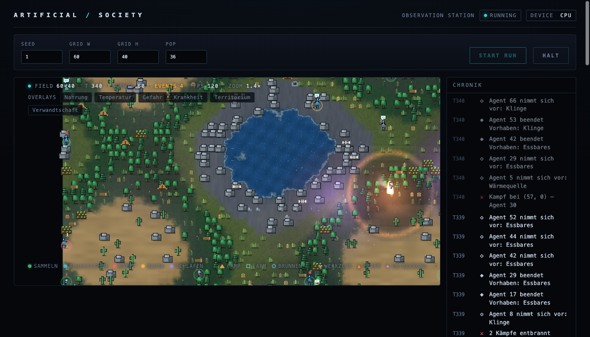
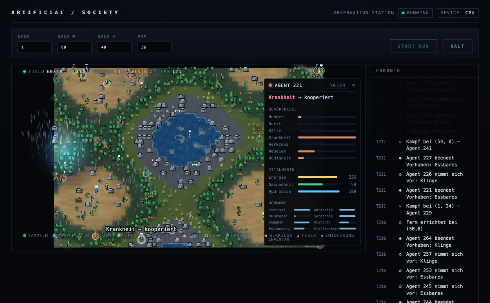

# Artificial Society

[](https://www.python.org/)

> **A world where nothing is scripted — and an open question about what a society can *learn* to become.**

Hundreds of agents, each running its own small neural network, live in a 2D world of
biomes, weather and seasons. They forage, fight, make tools, build, form tribes and raise
generations. The one rule of the project: **no behaviour is hard-coded.** Whatever an agent
does, it must have a reason — and, eventually, must *learn* — to do it.



## What you're looking at

The image above is the live **Observation Station** dashboard *(the UI labels are in German)*.

- **Left — the world.** Pixel-art terrain, trees and water, agents moving around, and a
  wildfire spreading near a lake. Toggleable overlays paint food, temperature, danger,
  disease, territory and kinship straight onto the map.
- **Right — the Chronicle.** A live feed of what agents actually *decide*: *"Agent 66 sets
  out to make a blade"*, *"Agent 42 finished: food"*, *"Combat at (57, 0)"*, *"2 fights
  broke out"*. You watch a society narrate itself, tick by tick.

Open any agent and you find it isn't a state machine:



Each agent has **needs** (hunger, thirst, cold, curiosity, fatigue), **vital signs** (energy,
health, hydration) and an **endocrine system** — cortisol, dopamine, oxytocin, serotonin,
adrenaline — that modulates how it feels and what it chooses. It carries episodic memories
and a rudimentary theory of mind about the agents around it.

## The idea

The goal is a world in which agents **learn** capabilities the way humanity did —
communication and language, tool-making, building, reshaping their environment. Nothing is
pre-granted: the world only makes those capabilities *possible* and *advantageous*, and
agents have to discover and learn them. Hard-coded *"when X, do Y"* behaviour is treated as
a defect, not a feature.

And here is the honest part. An earlier research effort built on this simulation was wound
down, and its central finding reframed everything: **the bottleneck isn't the world — it's
the learning machinery and how tightly it's coupled to that world.** So the current work is
not "watch language emerge." It's the unglamorous question underneath it: in a world this
rich, can agents that *learn* actually outperform agents that don't? A **Milestone-1 pilot**
is running that A/B — learning on vs. off — right now. The mechanics are in place; whether
genuine open-ended emergence arises is the open question we are actively testing. See the
capability roadmap in [`docs/roadmap.md`](docs/roadmap.md) §4b; the earlier apparatus is
preserved under [`archive/`](archive/README.md).

## What happens in the world today

From nothing but local, per-agent decisions, these systems are already alive and interacting:

- **A living environment** — biomes, weather, seasons and a day/night cycle; resources that
  grow and deplete; physical events like wildfires that spread, injure and reshape the map.
- **Embodied agents** — needs, a hormone/endocrine system, episodic memory, genetics, and a
  theory of mind of others.
- **Society-level behaviour** — foraging, combat, tool-making, building, tribes, a simple
  economy and trade, technology, culture, and evolution across generations.

Honest caveat: today much of this is driven by *learnable mechanisms wired into the world*,
not yet by deep, learned strategy. Closing that gap is the entire point of the project.

## See it yourself

Requires **Python 3.9+**. From the repository root:

```bash
python -m venv venv
source venv/bin/activate            # Windows: venv\Scripts\activate
pip install -e .                    # core deps: numpy, torch, pygame, …
```

> **GPU note:** for an NVIDIA RTX 50-series (Blackwell / sm_120) card, install torch from the
> CUDA 12.8 index *first*: `pip install torch --index-url https://download.pytorch.org/whl/cu128`.
> Full Windows/GPU setup: [`docs/serve-setup.md`](docs/serve-setup.md).

**Watch it in a window:**

```bash
python -m artificial_society.main
```

**Run the live dashboard** (drives a headless sim in a background thread, serves a UI on
port 8000 — great for hosting on a GPU box and observing from your laptop over the LAN):

```bash
pip install -e ".[serve]"                             # adds fastapi + uvicorn
PYTHONHASHSEED=0 python -m artificial_society.serve    # or scripts/run-dashboard.{bat,sh}
```

Then open `http://localhost:8000` (or `http://<host-ip>:8000` from another machine).

**Reproducible headless run:**

```bash
PYTHONHASHSEED=0 python -m artificial_society.main --headless --seed 42 --ticks 2000
```

Useful flags: `--seed`, `--ticks`, `--grid-w`, `--grid-h`, `--pop`.

## How it works

Each agent runs a small neural network — a policy net, a world model and an episodic memory
(see [`agents/brain.py`](artificial_society/agents/brain.py)) — so the simulation is
genuinely compute-heavy and benefits from a CUDA GPU; `brain.py` picks the device
automatically (`cuda` if present, otherwise `cpu`). A single `Simulation` object owns the
world, the agents and every system, and advances them through one tick loop. Society-level
systems self-register through a registry, so new behaviour can be added without editing the
core.

```
artificial_society/
  simulation.py          the Simulation god-object: world, agents, systems, tick loop
  world.py, main.py      world model + CLI / pygame entry point
  rng.py                 central RNG — all randomness routes through seed_all
  agents/                per-agent systems: brain, genetics, memory, endocrine, culture, …
  environment/           biomes, weather, seasons, resources, territory, events, …
  systems/               tribes, economy, technology, evolution, language, trade, …
  visualization/         pygame overlays, matplotlib graphs, statistics
  serve/                 headless web dashboard (runner + FastAPI app + static UI)
tests/                   pytest suite (incl. determinism / golden-trajectory contracts)
docs/                    setup, roadmap and contributor guides
archive/                 abandoned research apparatus (not imported, tested or packaged)
```

## Status & reproducibility

The project is in its **Milestone-1 pilot**: an A/B experiment on whether learning helps at
all (see [`docs/roadmap.md`](docs/roadmap.md)). Underneath the research question sits
engineering we take seriously — **a given seed produces a bit-identical initial world and
population.** This is locked by golden-trajectory and headless-digest tests, and all
randomness must route through `artificial_society.rng.seed_all`; a red golden trajectory
means behaviour changed. The suite (300+ tests, including that determinism contract) runs in
CI on every change.

```bash
python -m pytest -q
```

## Contributing

The repo is structured so several contributors — and parallel Claude Code agents — work in
isolated *lanes* (`core`, `agents`, `environment`, `systems`, `visualization`, `infra`) with
minimal conflicts. Start with [`docs/agent-quickstart.md`](docs/agent-quickstart.md), claim a
task from [`docs/roadmap.md`](docs/roadmap.md), and see
[`docs/ownership.md`](docs/ownership.md) for lane and hot-file rules.
[`CLAUDE.md`](CLAUDE.md) holds the conventions and invariants in full.
